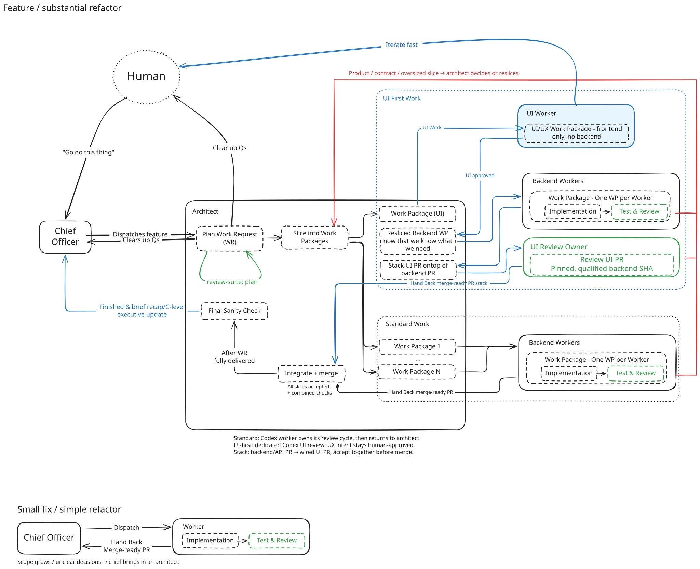

# Factory Workflow

**Status: approved beta contract; source capabilities implemented, combined
host qualification pending.** The diagram remains the approved product intent. Use
[Current system](../system.md) and the [packaged skills](../../plugins/symphony-plus-plus-mcp/skills/)
for what works today.

The aim is a lean, agent-agnostic delivery system whose human operator can see
who owns work, what is happening, what is waiting, and who acts next.



[Open the SVG](factory-workflow.svg) or edit the
[Excalidraw source](factory-workflow.excalidraw). Both capture the final human
diagram. Its “Final Sanity Check” happens **after WR fully delivered**.

## Separate The Request, Workflow, And Actor

| Dimension | Choices |
|---|---|
| Request type | Feature, bug fix, refactor. |
| Workflow | Direct delivery for small clear work; architect-led delivery for substantial work; UI collaboration when human design iteration is needed. |
| Actor | Domain chief, feature architect, worker, UI collaborator, optional dedicated UI review owner. |
| Execution configuration | Model, provider, host, and pane are configurable choices, not workflow states or role names. |

A bug fix may need an architect if scope or decisions demand one. A small
refactor may go directly to a worker. Request type does not impose an agent
hierarchy. Existing coordinator/worker delivery supports the small-work loop.

The domain chief is a persistent product/architecture owner and the usual human
entrypoint. Chiefs understand service responsibilities and coordinate decisions
across domains. They do not all need to sit under a machine-wide LLM supervisor.
A current calling agent can own small work without introducing another chief.

The feature architect owns one substantial request: clarify intent, review the
plan, slice and dispatch work, resolve findings, integrate, and oversee merges.
The human may keep speaking to the chief or work directly with the architect
when detailed refinement is useful. Direct human/UI collaboration is expected;
the chief receives decisions and an executive recap rather than relaying every
utterance. Durable decisions belong with the request, not only in chat.

## Small Clear Work

```text
Chief / calling coordinator
  -> bounded worker assignment
  -> reading / inventory
  -> implementation
  -> required checks
  -> declared review and fixes
  -> merge-ready handoff
  -> calling owner accepts + merges
  -> delivered
```

Use a WorkRequest/WorkPackage when delivery tracking is wanted. Ordinary
coordinator work does not require persistence; Solo remains optional. Growing
scope or unresolved product decisions return to the caller, who can introduce
an architect. Do not force a large-work planning ceremony onto a one-PR fix.

## Feature Or Substantial Refactor

| State | Owner and exit |
|---|---|
| Clarify | Chief/architect and human agree on outcome, constraints, acceptance, and meaningful open decisions. |
| Plan | Architect develops the plan and runs Review Suite plan review; verified findings refine it. |
| Slice | Architect creates bounded WPs with scope, dependencies, checks, review needs, and stop conditions. |
| Execute | Ready workers run concurrently; blocked dependencies wait. Each worker owns implementation, checks, and review convergence. |
| Resolve | Technical findings return to the worker. Product/contract conflicts or oversized slices return to the architect. |
| Integrate | Architect accepts all required slices, verifies combined behavior, and merges in dependency order. |
| Delivered | Required current WPs are delivered and agreed WR acceptance is met. |
| Post-delivery sanity | Architect checks the delivered result and sends the chief/human a brief recap; discovered issues become follow-up work. |

The worker loop is compact: **implemented → required checks green → declared
review settled → merge-ready**. Handoff names the candidate, check outcomes,
provider-native review reference, and remaining limitations. Reuse valid
evidence when its relevant inputs and conditions are unchanged. Do not invent
extra review receipts or have each actor repeat the same checks.

Review findings are hypotheses until their assumptions and reachability are
verified. Technical fixes return to the worker check/review loop. Product
intent, contract changes, and scope expansion go to the architect; significant
human decisions go to the human. Only affected work waits. Long review duration
must be visible; it can prompt reslicing, not endless automatic review rounds.

Reslicing replaces the affected assignment with clear successor scope and
preserves prior evidence. Canceled or superseded packages do not by themselves
prove the product goal was delivered. The post-delivery sanity check is not
another gate between merge and WR completion.

## UI Collaboration Lane

1. The architect dispatches a UI collaborator in a Herdr pane. Human and
   collaborator iterate rapidly on realistic demo data to discover the UI/UX.
2. The human approves and freezes UX intent. Record interaction behavior,
   states, acceptance, and required data/API shape. Prototype completion alone
   is not a production wiring or merge claim.
3. The architect reslices backend/API and wiring work using what the UI
   discovery established. Backend workers follow the ordinary delivery loop.
4. Build the code dependency stack: **main ← backend/API PR ← wired UI PR**
   for a same-repository stack, even though the prototype came first. Across
   repositories, track explicit candidate dependencies instead of pretending
   GitHub can make one cross-repository branch stack.
5. A dedicated review owner runs technical UI review against a pinned,
   qualified **unmerged backend candidate SHA**. Review can finish before the
   backend merges. Relevant backend or UI changes invalidate only affected
   evidence. Check the final combined candidate before acceptance.
6. The architect accepts the complete stack, confirms combined checks, and
   merges backend before UI. UI waits until its backend dependency is delivered.

“Frozen” means product intent is human-approved. Performance, correctness,
authorization, accessibility, and wiring defects still need technical fixes.
If a fix materially changes approved UX, escalate the decision rather than
silently changing it or refusing to repair it. The dedicated reviewer owns
review convergence and handoff; fixes have an explicit implementation owner.

The ordinary worker can own its own Review Suite cycle. Delegating the UI
cycle is a workflow option to avoid spending the UI model's context and tokens
on review orchestration. Opus as UI collaborator and Codex as worker/reviewer
are examples, not hardcoded role constraints.

## Herdr Visibility

For each active request and agent, the operator needs:

- Accountable owner, current actor, role, and pane/thread link when available.
- Current activity: inventory, implementation, checks, review stage/round,
  merge-ready, integration, or finished.
- Time in the activity, especially review, and the latest meaningful update.
- Waiting reason, dependency/decision, and next actor/action.
- Explicit stale, missing, or disconnected signals instead of invented activity.

A milestone percentage may summarize progress, but it must show the current
stage and its basis. It is not an ETA; review rounds and reslicing may change
the remaining work. A “95%” badge cannot replace “waiting on architect decision
for 3 hours.” WR progress reflects current required scope and delivery, not
completed token volume or pane activity.

Symphony owns work/decision state; Herdr owns panes and execution observation;
GitHub and review providers own their outcomes. Link these sources and expose
the next action without making duplicate systems of record. Missing observation
must not authorize a worker takeover or imply delivery.

## Starting Point And Implementation Order

The beta starts from main after the delivered prerequisite changes:

| Baseline | Available evidence |
|---|---|
| Less procedural duplication | [PR #692](https://github.com/JJLiebig/symphony-plus-plus/pull/692). |
| MCP-only ledger access | [PR #693](https://github.com/JJLiebig/symphony-plus-plus/pull/693); operational shell tools still install, start, inspect, and repair. |
| Portable procedures | [PR #694](https://github.com/JJLiebig/symphony-plus-plus/pull/694); `npx skills` installs procedures, with MCP configured separately. |
| Mixed-host pilot | WR `wr_ixqbhpua2ajgbepu`, completed without PR: actual Windows Codex and Claude clients used one isolated ledger with distinct claims, scope denial, reconnect, and readiness. |

The pilot used an operator-owned cockpit and operator-run Review Suite handoff.
Claude readiness needed operator help because its displayed MCP error omitted
the actionable reason. Beta now returns actionable readiness messages. Autonomous
native review discovery, standalone managed startup/leases, and macOS/Linux
distribution remain unproven. Beta board/Herdr observation is implemented;
combined native-host qualification remains pending.
These are bounded implementation/qualification gaps, not claims of complete
cross-host support or a reason to repeat the same pilot before useful work.

Current beta source provides delivered-scope/successor resolution, exact-head
candidate dependencies and consumed-input staleness, pre-merge eligibility,
actionable readiness errors, and board/Herdr owner/activity/wait observations.
[Current system](../system.md) and [Operations](../operations.md) describe these
capabilities. The packaged
[architect procedure](../../plugins/symphony-plus-plus-mcp/skills/symphony-architect/references/operations.md#ui-collaboration-and-candidates)
owns durable approval, explicit claim handoff, candidate selection, successor
replacement and ordered merge; this contract is not a second agent checklist.

Qualify the combined direct and architect/UI paths with actual available native
hosts in an isolated beta home/ledger. Checkout-backed beta qualification is
separate from installed marketplace runtime qualification or a stable cutover.

Keep useful ledger, authorization, delivery, and runtime machinery. Remove
duplicated procedures and obsolete surfaces when their replacements exist.
A generic fleet manager, provider runner, or wholesale runtime rewrite is not
a prerequisite for this workflow. Code changes and their concrete acceptance
belong in bounded WorkPackages rather than an expanded procedure rewrite.
